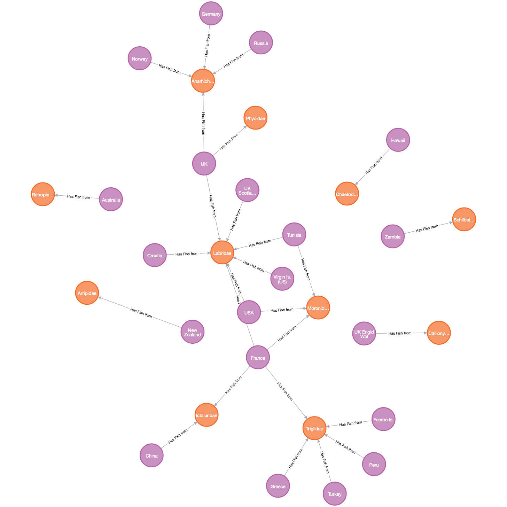

# knowledge-networks
Creating knowledge networks by integrate multimodal knowledge


## Install
```
pip install -r requirements.txt
```

## Execution 
```
python create_knowlege_graph.py
```

## Demonstration

