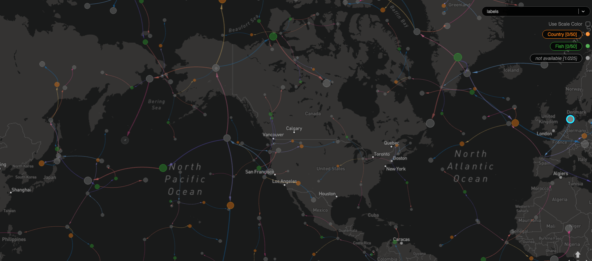
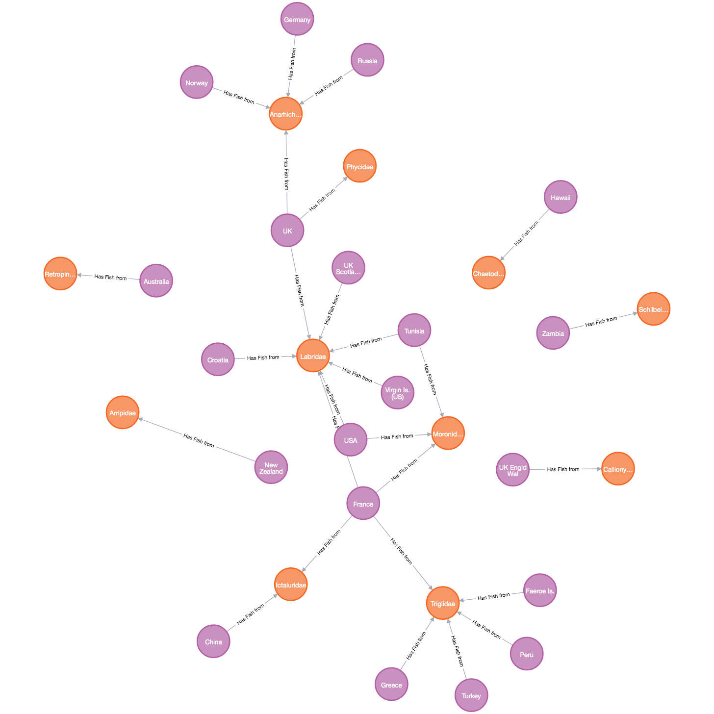

# knowledge-networks
In this project, we have created knowledge networks by integrating multimodal knowledge from the FishBase Dataset.
The knowledges associated with the world map. 

## Install
```
pip install -r requirements.txt
```

## Execution 
```
python create_knowlege_graph.py
```

## Demonstration
Knowledge Network:<br>


Structure of Knowledge Graph:<br>


## Reference
Luna, Susan and Barile, Josephine France R. (2016): Data on growth rates of fish from FishBase. University of Reading. Dataset. https://doi.org/10.17864/1947.66
